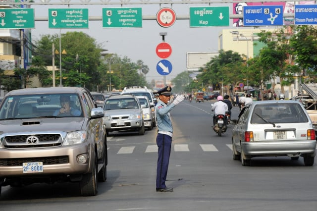
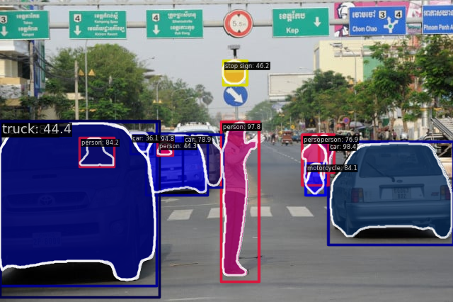
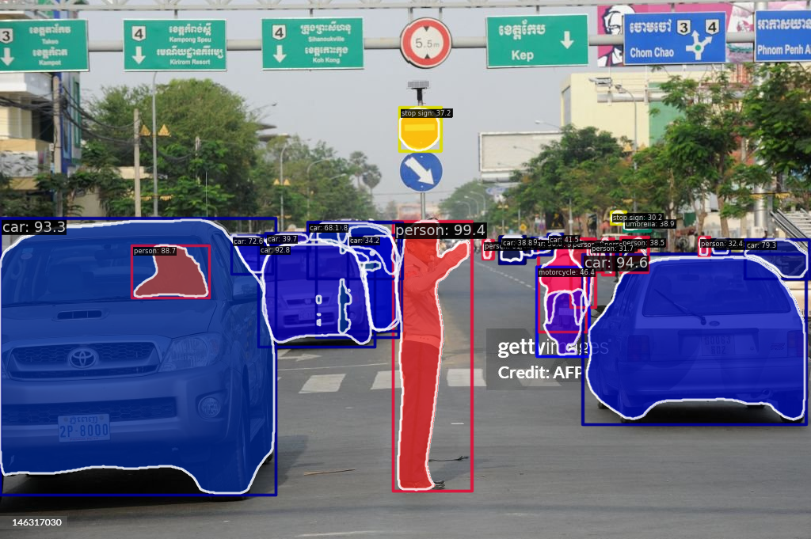

# Using mmdection for traffic scense detectoion (Graduation Thesis)

## MMDetection Commands

## Verify Installed Versions and CUDA Availability

Run the following commands to check your installed versions:

```python
import torch
import mmcv

print("Python Version:", "3.8.20")
print("Torch Version:", torch.__version__)       # Should print 2.0.1+cu118
print("CUDA Version:", torch.version.cuda)      # Should print 11.8
print("MMCV Version:", mmcv.__version__)        # Should print 2.0.1
print("CUDA Available:", torch.cuda.is_available())  # Should print True
```

## Running Image Inference

### RTMDet Model
To perform inference using the RTMDet model on an image with CPU:

```sh
python demo/image_demo.py demo/image.png rtmdet_tiny_8xb32-300e_coco.py \
--weights rtmdet_tiny_8xb32-300e_coco_20220902_112414-78e30dcc.pth --device cpu
```

### ViTDet Model
To perform inference using the ViTDet model with CUDA:

```sh
python demo/image_demo.py demo/demo.jpg projects/ViTDet/configs/vitdet_mask-rcnn_vit-b-mae_lsj-100e.py --weights vitdet_mask-rcnn_vit-b-mae_lsj-100e_20230328_153519-e15fe294.pth --device cuda
```
or
```sh
(openmmlab) D:\Y4S2\Thesis\mmdetection>python demo/image_demo.py demo/data/demo.jpg projects/ViTDet/configs/vitdet_mask-rcnn_vit-b-mae_lsj-100e.py --weights work_dirs/vitdet_mask-rcnn_vit-b-mae_lsj-100e/iter_100000.pth --device cuda
```

To infer an image using a fine-tuned ViTDet model:

```sh
python demo/image_demo.py demo/image-small-vit.png projects/ViTDet/configs/vitdet_mask-rcnn_vit-b-mae_lsj-100e.py --weights work_dirs/vitdet_mask-rcnn_vit-b-mae_lsj-100e-small/iter_500.pth --device cuda
```

## Training with a Custom Dataset using ViTDet Model

### Steps to Prepare the Dataset
1. Create a directory named `data` under the `mmdetection` directory.
2. Inside `data`, place the COCO dataset structure:
   - `train2017/`
   - `val2017/`
   - `annotations/`
3. Download the `mae_pretrain_vit_base.pth` file and place the this checkpoint in `vitdet_mask-rcnn_vit-b-mae_lsj-100e.py` in the configuration file.

### Train the Model
Use the following command to train the model with the custom dataset:

```sh
python tools/train.py projects/ViTDet/configs/vitdet_mask-rcnn_vit-b-mae_lsj-100e.py
```
### Test the Model
Use the following command to train the model with the custom dataset:

```sh
python tools/test.py projects/ViTDet/configs/vitdet_mask-rcnn_vit-b-mae_lsj-100e.py work_dirs/vitdet_mask-rcnn_vit-b-mae_lsj-100e/iter_100000.pth
```
## Running Inference with a Specific Checkpoint

To infer an image using a trained model at a specific iteration:
### VIT with Mask RCNN
```sh
python demo/image_demo.py demo/image.png projects/ViTDet/configs/vitdet_mask-rcnn_vit-b-mae_lsj-100e.py \
--weights work_dirs/vitdet_mask-rcnn_vit-b-mae_lsj-100e/iter_10000.pth --device cuda
```
### VIT ith Cascade_MAsk-RCNN  head
```
python demo/image_demo.py demo/t2-e2.png projects/ViTDet/configs/vitdet_cascade_mask-rcnn_vit-b-mae_lsj-100e.py --weights work_dirs/vitdet_cascade_mask-rcnn_vit-b-mae_lsj-100e/iter_55000.pth --device cuda
```


### Experiement Result
### original image

### demo of official model 
config:
```python
image_size = (1024, 1024)
train_loader: batch_size = 4, number of worker = 8
val_loader : batch_size =1 , numnber of worker = 4
186736 iteration
```


### Experiment 1: VIT with Mask RCNN 50 FPN
#### COCO Evaluation Results
config:
```python
image_size = (1024, 1024)
train_loader: batch_size = 2, number of worker = 8
val_loader : batch_size =1 , numnber of worker = 2
100000 iteration
```


#### Bounding Box (bbox) Metrics

| Metric                 | Value |
|------------------------|-------|
| **mAP@[IoU=0.50:0.95] (all)** | 0.316 |
| **mAP@[IoU=0.50] (all)** | 0.505 |
| **mAP@[IoU=0.75] (all)** | 0.350 |
| **mAP@[IoU=0.50:0.95] (small)** | 0.188 |
| **mAP@[IoU=0.50:0.95] (medium)** | 0.342 |
| **mAP@[IoU=0.50:0.95] (large)** | 0.410 |

#### Segmentation (segm) Metrics

| Metric                 | Value |
|------------------------|-------|
| **mAP@[IoU=0.50:0.95] (all)** | 0.300 |
| **mAP@[IoU=0.50] (all)** | 0.486 |
| **mAP@[IoU=0.75] (all)** | 0.320 |
| **mAP@[IoU=0.50:0.95] (small)** | 0.137 |
| **mAP@[IoU=0.50:0.95] (medium)** | 0.324 |
| **mAP@[IoU=0.50:0.95] (large)** | 0.441 |

#### Recall Metrics

| Metric                 | Value |
|------------------------|-------|
| **AR@[IoU=0.50:0.95] (all, maxDets=100)** | 0.480 |
| **AR@[IoU=0.50:0.95] (all, maxDets=300)** | 0.480 |
| **AR@[IoU=0.50:0.95] (all, maxDets=1000)** | 0.480 |
| **AR@[IoU=0.50:0.95] (small, maxDets=1000)** | 0.302 |
| **AR@[IoU=0.50:0.95] (medium, maxDets=1000)** | 0.516 |
| **AR@[IoU=0.50:0.95] (large, maxDets=1000)** | 0.610 |


